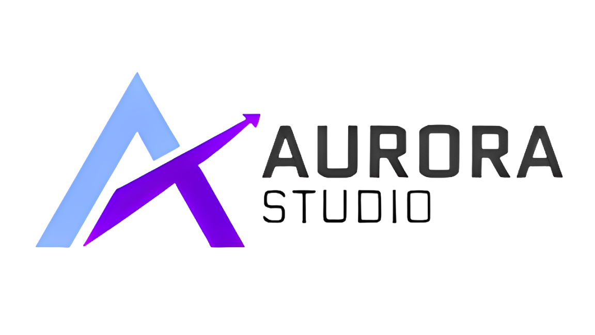

  

    Unleash your creativity, software shapes the future.

## 🕹️ Our projects
- 🚩 Aurora Star Launcher - This is a fluent launcher on **WPF** of game **Minecraft**

  - Lang: Chinese

  - Website： https://asl.thzstudent.top
 
  - Docs: https://aurorastudio.top/docs/asl/
 
## 🎏 Website & Community

> ### Tips
> 
> We assume that your location is currently within the territory of the People's Republic of China.
> 
> Thank you for your understanding.

- [Website](https://aurorastudio.top)
  
- QQ group：386255002

- [QQ channel](https://pd.qq.com/s/9zlnq470x)

- [Discourd](https://discord.gg/ephHTMH9)
  
## 👨🏻‍🎨 How to Contribute

> ### Tips
> 
> We assume that your location is currently within the territory of the People's Republic of China.
> 
> Thank you for your understanding.

- If you want to contribute to our projects, please read: [Contribution Guidelines](#)

- If you would like to sponsor or support us, we have done so in the following ways:

  - 爱发电 ： https://ifdian.net/a/thzstudent
 
  - WeChat & AliPay : https://aurorastudio.top/aponsor  (Plaese use you smart phone.)
 
- Thanks for your love and support!
